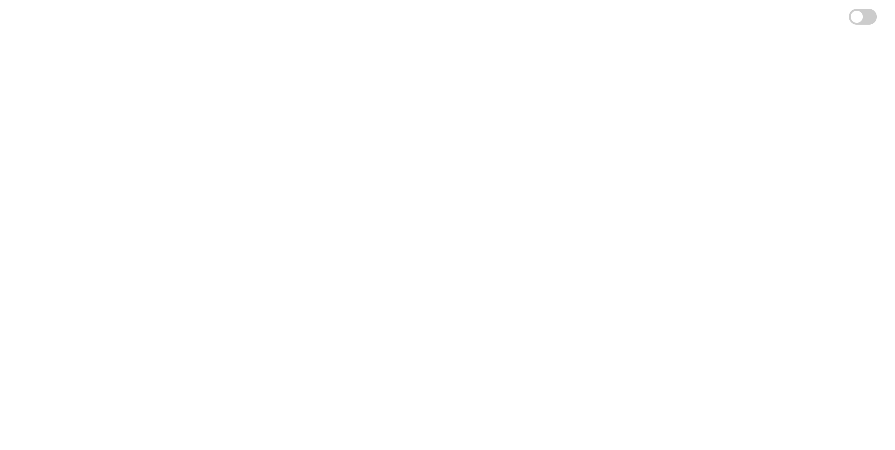
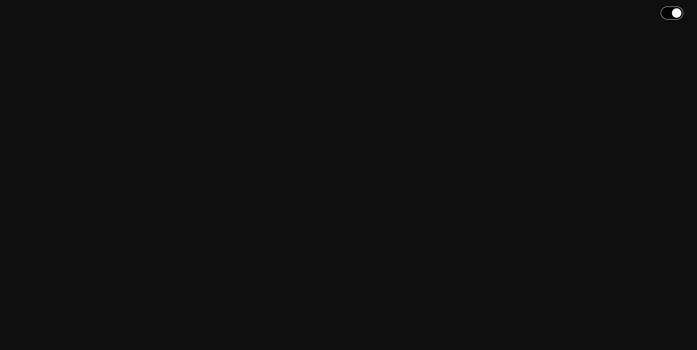
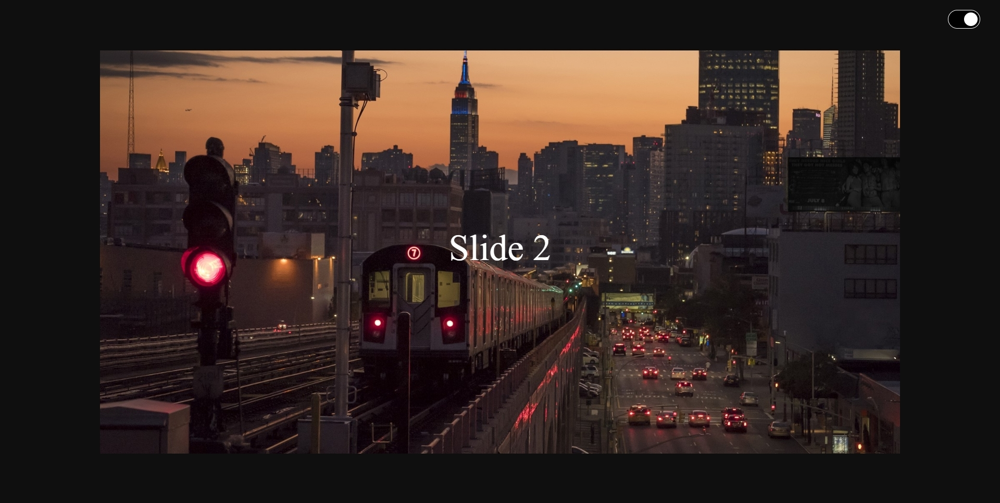
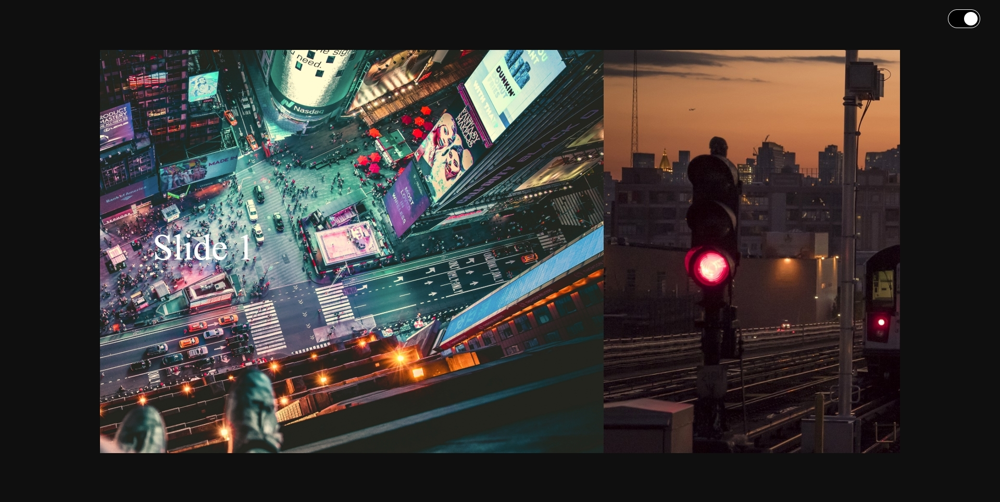
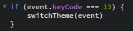
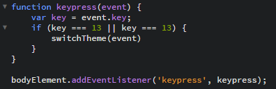
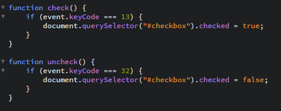

# Procesverslag Opdracht 2 | Kaj van Duijn

## Eerste les

schetsen

Nadat ik had gekozen voor de case om een afbeeldingen carousel te hebben die lichte of donkere afbeelding liet zien op basis van of je de dag of nacht modus had geselecteerd was ik gaan beginnen met schetsen.

Eerste prototype

Dit was het eerste prototype wat ik had gemaakt voor deze case, het is een checkbox in de vorm van een toggle knop. Deze toggle knop werkt nog niet.

Dit heb ik voor het einde van de eerste les nog af kunnen maken. Het is dezelfde checkbox alleen nu kan je het ook echt op donker of licht zetten. 

## Tweede les 

tweede prototype 

Dit is het tweede prototype wat ik heb gemaakt. Ik heb ervoor gezorgt dat een afbeelding in het midden staat met de naam van de slide in het midden. Ik heb verder nog geprobeerd om de afbeeldingen om de beurt te krijgen te zien maar dat is mij niet gelukt.

## Laatste week 

Derde prototype

Aan het begin van de laatste week heb ik het voor elkaar gekregen om met keyframes de slides een voor een te kunnen laten zien en het speelt zichzelf dus automatisch af. Ook heb ik ervoor kunnen zorgen dat wanneer de knop aan of uit staat een bepaalde set foto's word laten zien.

## Errors

Ik heb geprobeerd om de knop voor dag en licht te kunnen besturen door middel van toetsen op het toetsenbord. Dit is mij helaas niet gelukt maar hier laat ik een aantal dingen zien die ik heb geprobeerd en dus allemaal niet gelukt zijn. Ik denk dat het komt omdat ik gebruik maak van een checkbox en niet een knop maar hier ben ik te laat achter gekomen om het nog te veranderen.

Het eerste wat ik geprobeerd heb. Dit was simpelweg de functie aanroepen die de ervoor zorgt dat de switch aan en uit gaat en dat heb ik gecombineerd met een if statement maar dit werkte niet.

Het tweede wat ik heb geprobeerd. Ik heb hier geprobeerd gebruik te maken van een function en daarbij ook een eventlistener maar dit heeft ook niet gewerkt

Dit is het laatste wat ik heb geprobeerd. Ik heb hier geprobeerd de checkbox te checken of unchecken met een toets, maar dit is helaas ook niet gelukt.
