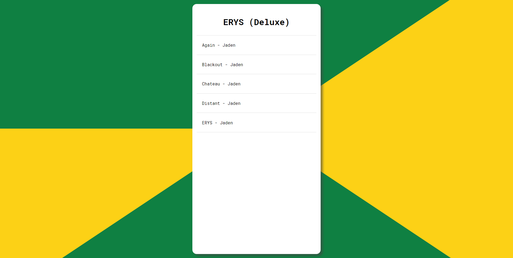
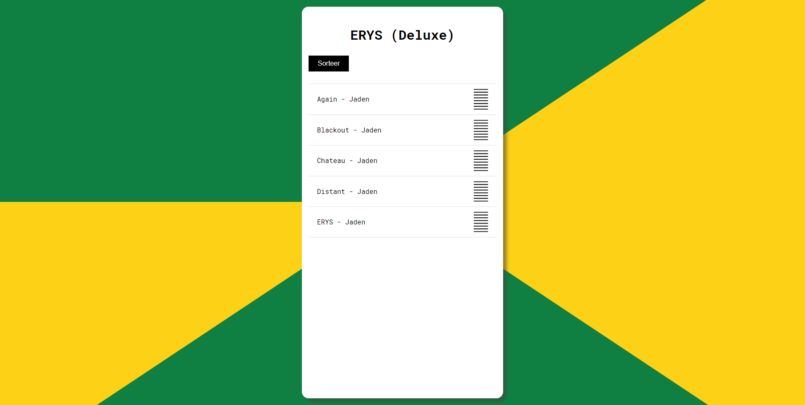

# Procesverslag Kaj van Duijn

## Eerste les

schetsen

Na het kiezen van de case voor het veranderen van de volgorde in een afspeellijst heb ik deze schetsen gemaakt als eerste ideeen

Eerste prototype

Dit was het eerste prototype wat ik heb gemaakt voor deze case. Het is een list met nummers en een Titel erboven.

## Tweede les 

tweede prototype 

Dit was het tweede prototype wat ik heb gemaakt. Hier heb ik samen met Sanne rechts van de nummers pijltjes toegevoegd zodat het voor de gebruiker duidelijk is dat hij de volgorde van nummers kan veranderen.

## Vakantie 

Derde prototype

In de vakantie heb ik een sorteer functie gemaakt voor de case, deze sorteer functie sorteert op basis van alfabetische volgorde. Dit heb ik gedaan nadat mij het niet meer lukte om volgorde te veranderen door op de pijl knopjes te klikken.

## Voor de laatste les

Eindproduct

Dit is het eindproduct. Hier heb ik de pijltjes veranderd naar streepjes, dit laat het namelijk lijken alsof de gebruiker hier grip of heeft en hij dus denkt dat hij het hier kan slepen. 
