# Procesverslag Kaj van Duijn

## Week1

Dit was mijn eerste idee voor deze opdracht. Ik wou een kubus maken die je rond kon draaien met aan elke zijde een beetje informatie over de film.  

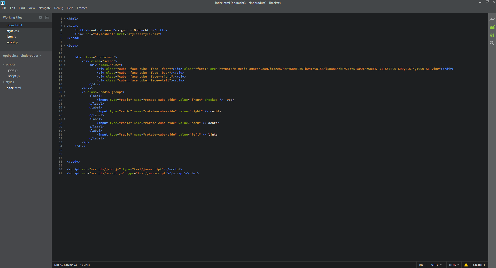

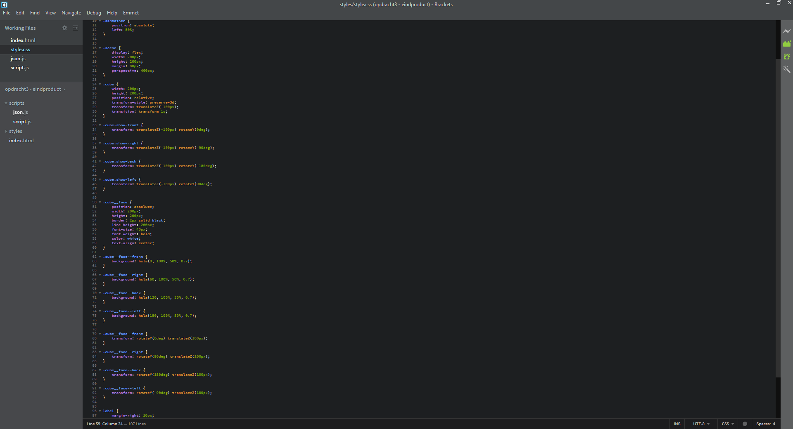

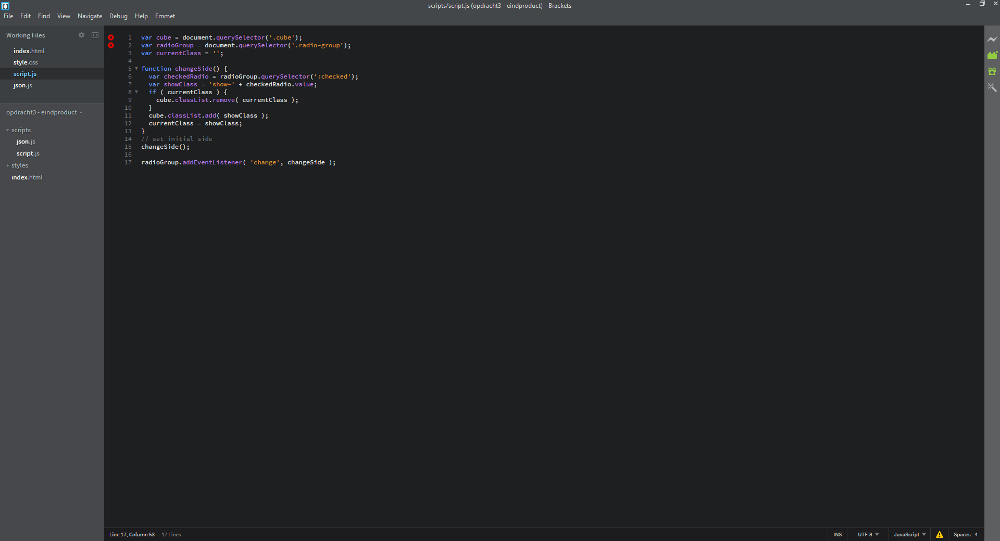

Dit was het eerste prototype dat is gemaakt op basis van mijn eerste schetsen. 

## Week 2

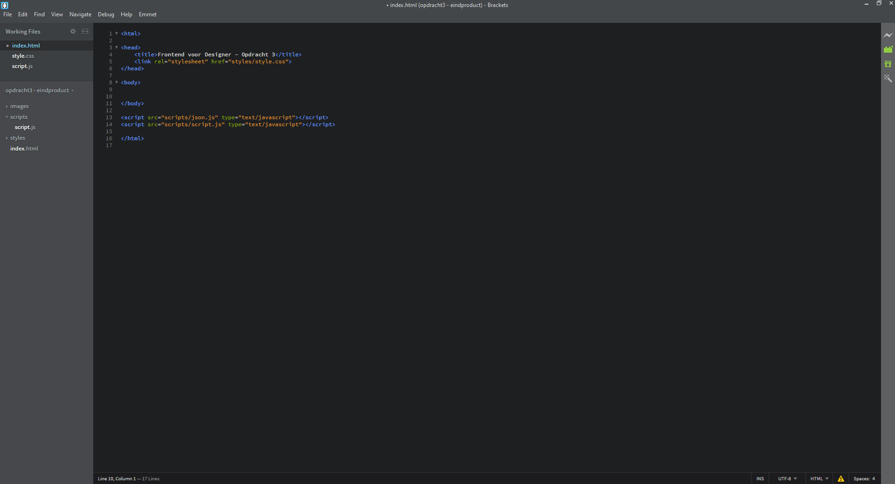

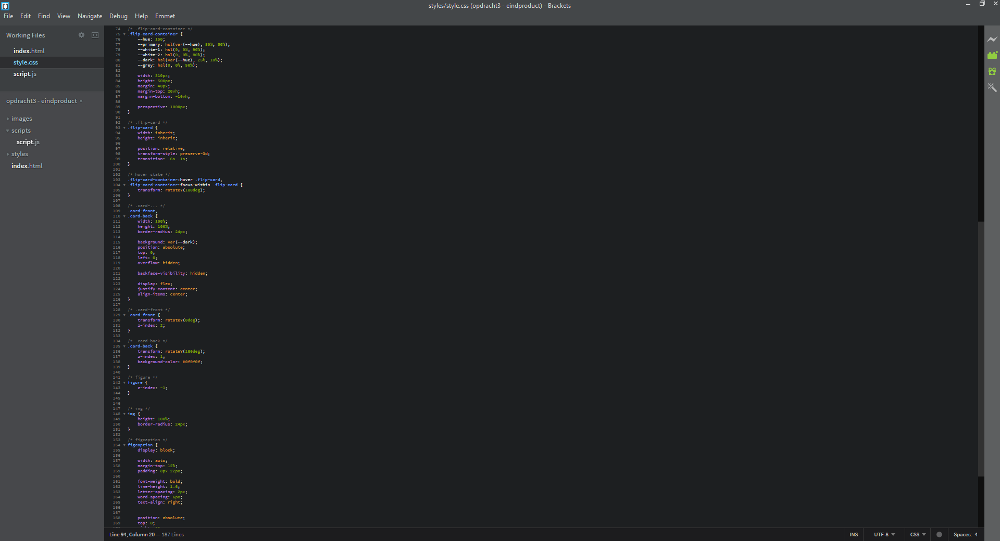

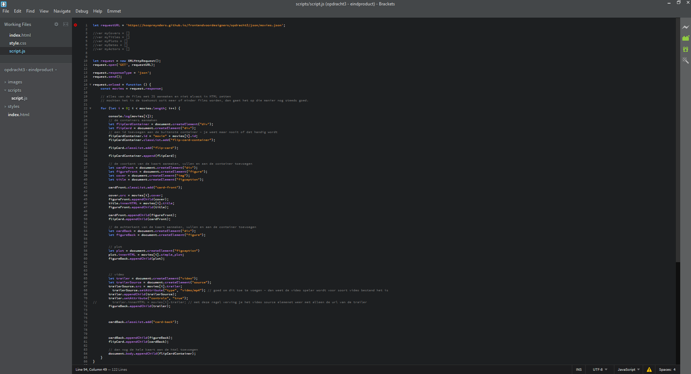

In week 2 besloot ik om het te veranderen. Hier ben geswitched van de kubus naar een kaart die je om kan draaien. Het was mijn bedoeling om een soort videotheek na te maken waarbij de films leken alsof ze in een cs hoes zaten, maar omdat het mij zelf niet lukte om de zijkanten dunner te maken en hierbij de cd hoes te maken ben ik over gegaan naar kaartjes die omgedraaid kunnen worden. 

### Week 2 Errors

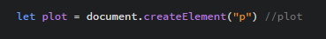
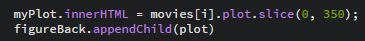

In week 2 had ik een aantal errors. Dit zorgde ervoor dat als ik het plot wou laten zien het hele scherm leeg werd en er dus helemaal geen content meer was.

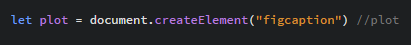
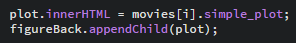

Na het veranderen van de code in javascript is het mij uiteindelijk wel gelukt om de content op de achterkant van het kaartje te krijgen. 

## Week 3

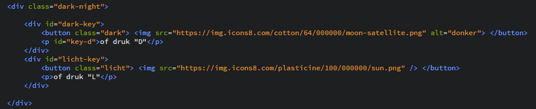
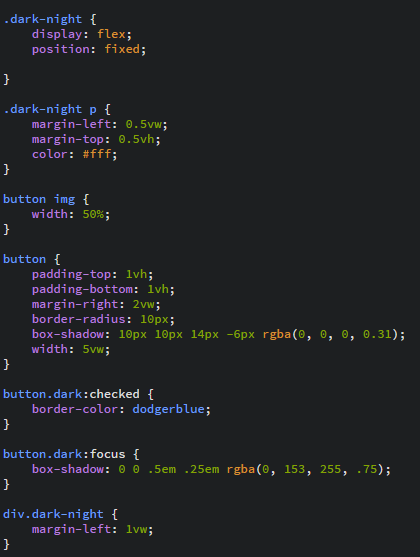

In week 3 heb ik een extra functie toegevoegd omdat ik na het klikken van "Tab" om de kaartjes om te draaien nog een extra functie wou hebben op de website die met toets input werkte. Dit wou ik graag doen omdat bij de vorige opdracht het mij niet was gelukt om het te laten werken. 

### Week 3 Errors 

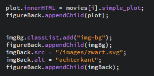
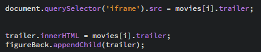

Ik had nog 1 error en dat was bij de trailer van de film. Hier werkte wel het iframe waarin de video afgespeeld moest worden maar de video zel werd niet laten zien. 

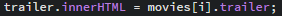

Het probleem hier was dat ik in het iframe de link liet zien van de trailer van de film. Hierdoor kon dus de video niet worden laten zien. 
